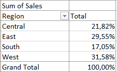
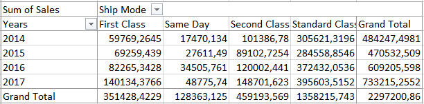
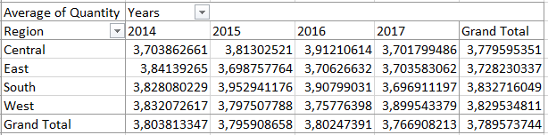
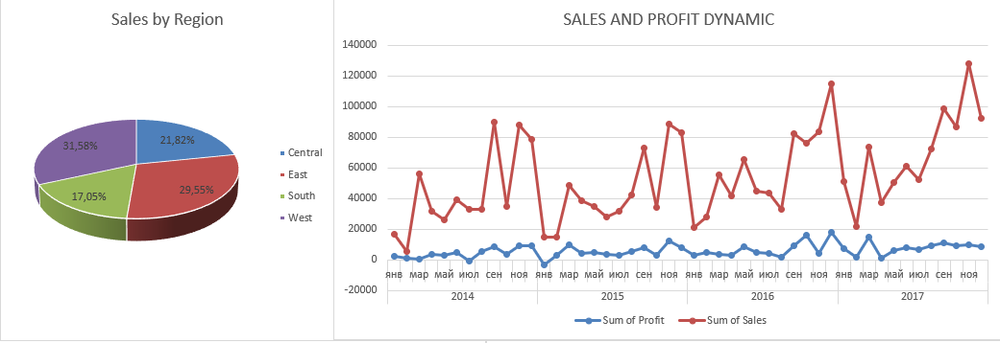
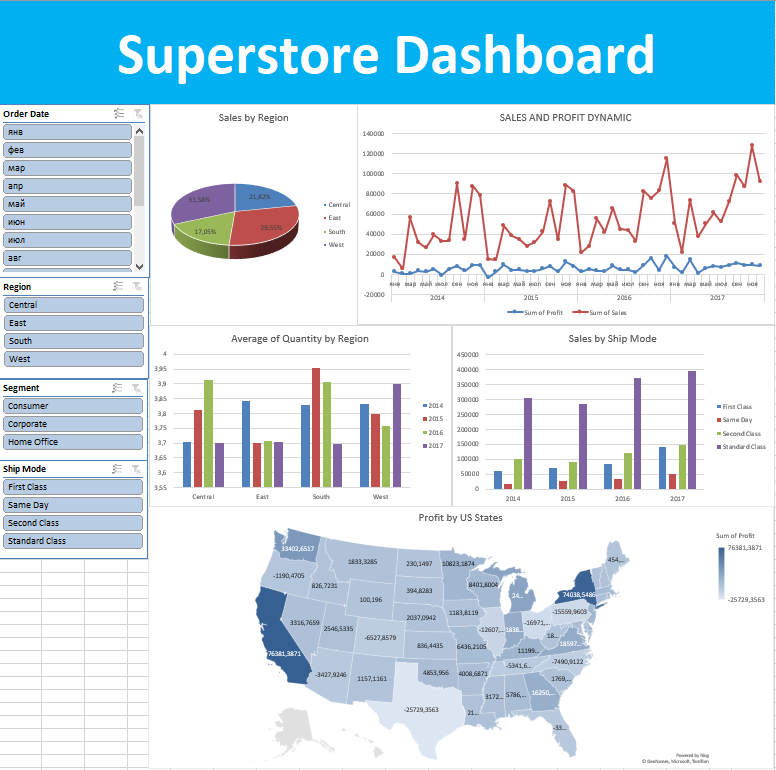

# MyProjects

## My First Dashboard in Excel

My first project where I analysed SuperStore DataSet in Excel.

**Step 1**

I added two additional fields, the **Cost per Item**, and a field **Returned** that shows the returned item. To calculate the field **Returned** i used formula

```bash
=IFNA(VLOOKUP(B2;Returns!A:B;2;FALSE);"No")
```

**Step 2**

Сreate several Pivot tables for various metrics for the dashboard.





**Step 3**

Next, create charts based on pivot tables



**Step 4**

Finally, we create our dashboard with all the charts and adding several slicers to filter the data

