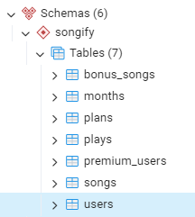
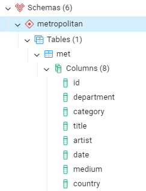
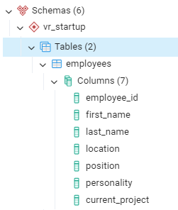

## SQL tasks to practice join, union, like, case.

You can find [dataset3](./Files/dataset3_songify.xlsx) , [dataset4](./Files/dataset4_metropolitan.xlsx), [dataset5](./Files/dataset5_vr_startup.xlsx) and [script8](./Files/script8.sql) to practice and check the results.

### Database3 structure:

## Tasks for `songify`

1. Create schema songify.
2. Which subscription plans are used by premium users?
3. Retrieve the titles of songs each user listens to.
4. Who are the non-premium users?
5. Using CTE, find users who listened to music in January and February, then filter to only those who listened exclusively in January.
6. For each month in the months table, determine if each premium user was active or churned (did not renew their subscription).
7. Determine which users are active and inactive for each month.
8. Merge tables songs and bonus_songs using UNION and select all columns. Since songs is very large, just examine a sample of data and output only 10 rows using LIMIT.
9. Additional example usage of UNION.
10. Find the count of times each song has been played, including additional information from the songs table.

## Tasks for `metropolitan`

11. Create schema metropolitan.
12. Retrieve the first 10 records from the met table in the metropolitan schema.
13. How many artworks are in the American decorative arts collection?
14. Count the number of artworks where the category contains the word 'celery'.
15. Retrieve unique categories of artworks containing the word 'celery'.
16. Retrieve the title and medium of the oldest artworks in the collection.
17. Find the top 10 countries with the highest number of items in the collection.
18. Find categories with more than 100 artworks.
19. Count artworks made of gold or silver. Also output the material.

## Tasks for `vr_startup`

20. Create schema vr_startup.
21. Retrieve data from the employees table in the vr_startup schema.
22. Retrieve data from the projects table in the vr_startup schema.
23. What are the names of employees who have not chosen a project?
24. What are the names of projects that have not been chosen by any employee?
25. Which project is chosen by the majority of employees (specify the name)?
26. Which projects are chosen by multiple employees (more than 1)?
27. Each project needs at least 2 developers. How many available project positions are there for developers? Do we have enough developers to fill the required positions?
28. Which personality is most characteristic of our employees?
29. Which project names are chosen by employees with the most common personality type?
30. Find the personality type most represented among employees with a selected project. Provide the names of these employees, their personality type, and the project names they chose.
31. For each employee, list their name, personality type, names of any projects they have chosen, and the count of incompatible colleagues.