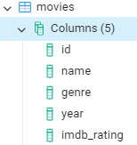
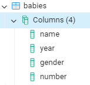
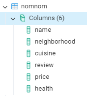
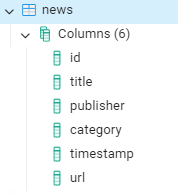
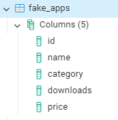

## SQL tasks to practice extraction, filtering, sorting, limit results and distinct.

You can find [dataset](dataset.xlsx) , [script1](script1.sql) and [script2](script2.sql) to practice and check the results.

### Database1 structure:


## Tasks for `video_game_sales`

1. **Select All Columns:**
    - Write a query to select all columns from the `video_game_sales` table.

    Solution:
    ```bash
    SELECT
	    *
    FROM
	    video_game_sales;
    ``` 
2. **Count Total Rows:**
    - Write a query to count the total number of rows in the `video_game_sales` table.
    
3. **Filter by Year:**
    - Write a query to select all games released after the year 2010.
4. **Sort by Sales:**
    - Write a query to select all games, sorted by global sales in descending order.
5. **Distinct Platforms:**
    - Write a query to select all distinct platforms from the `video_game_sales` table.
6. **Limit Results:**
    - Write a query to select the first 10 records from the `video_game_sales` table.
7. **Filter by Sales and Genre (AND):**
    - Write a query to select all games with global sales greater than 1 and genre as 'Action'.
8. **Filter by Multiple Conditions (OR):**
    - Write a query to select all games where the genre is 'Adventure' or 'Action'.
9. **Complex Filtering (AND, OR, BETWEEN):**
    - Write a query to select all games with global sales between 1 and 5 , and released in the year 2005 or 2006.


## Tasks for `avocado_prices`

1. **Select Specific Columns:**
    - Write a query to select the `Date`, `AveragePrice`, and `Region` columns from the `avocado_prices` table.
    ```bash
    SELECT
	    "date",
	    average_price,
	    region
    FROM
	    avocado_prices;
    ```
2. **Filter by Region:**
    - Write a query to select all records where the region is "California".
3. **Sort by Date:**
    - Write a query to select all records, sorted by date in ascending order.
4. **Average Price :**
    - Write a query to calculate the average avocado price
5. **Total Volume by Type:**
    - Write a query to calculate the total volume of avocados sold
6. **Filter by Price Range (BETWEEN):**
    - Write a query to select all records where the average price is between 1.00 and 1.50.
7. **Filter by Date and Region (AND):**
    - Write a query to select all records from the year 2018 and region as 'Albany'.
8. **Filter by Multiple Regions (OR):**
    - Write a query to select all records where the region is 'Chicago' or 'Boston'.
9. **Complex Filtering (AND, OR, BETWEEN):**
    - Write a query to select all records where the average price is between 1.00 and 2.00, and the type is 'conventional' or the region is 'California'.


## More practice

You can find [dataset2](dataset2.xlsx) , [script3](script3_movies.sql), [script4](script4_babies.sql), [script5](script5_nomnom.sql), [script6](script6_news.sql) and [script7](script7_fake_apps.sql) to practice and check the results.

### Database2 structure:








## Tasks for `Movies`

1. Write a query that will display all the data columns from the movies table

```bash
SELECT
	*
FROM
	movies;
```
2. Write a query that will display the name of the movie, genre and year
3. Write a query that returns the title of the movie, but rename the column to Titles
4. Write a query that will return unique genre names
5. Write a query that will return all columns from the movies table, provided that the movie rating is less than 5
6. Correct the previous query to display all columns from the movies table, provided the release year is greater than 2014
7. Write a query that will display only the names of movies, provided that their rating is not filled out
8. Correct the previous query so that the names of movies, provided that their rating is filled out
9. Write a query that will return all the data from the movies table for those movies that were released between 1990 and 1999 inclusive.
10. Write a query that will display all the data from the movies table for those movies whose first letter of the title lies between the letters of the alphabet A and J. Sort the result by movie title in alphabetical order
11. Write a query that will return all the data from the movies table for romance movies that were released between 1990 and 1999 inclusive.
12. Write a query that will return all the data from the movies table for movies with a rating greater than 8 that were released between 1970 and 1979 inclusive.
13. Write a query that will display all the data from the movies table for horror films that were released before 1985, not including this year
14. Write a query that will display all the data from the movies table for movies either in the action genre or those that were released after 2014, not including this year. Sort by genre alphabetically
15. Write a query that will return all the data from the movies table for movies in either the romance or comedy genres. Sort the results by genre name in reverse alphabetical order
16. Write a query that will display all the data from the movies table about the top 3 highest rated movies. Do not include movies that do not have a rating
17. Print the average rating of movies by year of release from the movies table. Sort the result by year of manufacture in ascending order
18. Write a request that will calculate for us the number of movie titles broken down by rating, and the rating should be rounded to the nearest whole number. Sort the result by rounded rating
19. Write a request that will calculate for us the number of movie titles broken down by year of release, with each year displayed broken down by genre. Print only those movies whose number is greater than 10 (not including 10). Sort the results by year of manufacture in descending order


## Tasks for `Babies`

1. Find the number of girls who were given the name Lillian. Print the year the name was given and the quantity
2. Output the child's name, gender, and the number of times this name was given in 1880. Sort the result by quantity in descending order and display only 10 records.


## Tasks for `Nomnom`

1. Display all data about restaurants serving Japanese cuisine with price category = '$$'
2. Display data about restaurants for which there is no health rating


## Tasks for `News`

1. Write a query that displays the title of the article and its publisher. Sort the results by article title in ascending order
2. Write a query that will display information about the last 20 articles that were published in the Business category (category = 'b')


## Tasks for `Fake_apps`

1. Count the number of records in the fake_apps table
2. Count the number of free applications in the fake_apps table
3. Calculate the sum of all application downloads in the fake_apps table
4. Calculate the maximum, minimum and average number of app downloads in the fake_apps table
5. Print the name of the application, its price as it is, and the price rounded to the nearest whole number
6. Find the average price for all applications and round the result to two digits
7. Write a query that allows us to count the number of applications with a specific price in the fake_apps table, provided that the number of downloads is more than 20,000
8. Write a query that will calculate the sum of downloads for each application category
9. Write a query that finds the average number of app downloads broken down by category, with each category shown by price. Sort results by category alphabetically