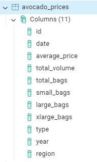
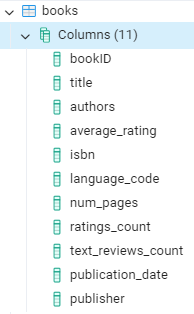
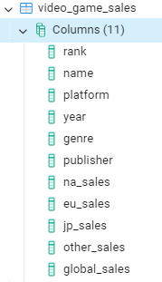

SQL tasks to practice extraction, filtering, sorting, limit results and distinct.

You can find [dataset](dataset.xlsx) , [script1](script1.sql) and [script2](script2.sql) to practice and check the results.

### Database structure:






## Tasks for `video_game_sales`

1. **Select All Columns:**
    - Write a query to select all columns from the `video_game_sales` table.

    Solution:
    ```bash
    SELECT
	    *
    FROM
	    video_game_sales;
    ``` 
2. **Count Total Rows:**
    - Write a query to count the total number of rows in the `video_game_sales` table.
    
3. **Filter by Year:**
    - Write a query to select all games released after the year 2010.
4. **Sort by Sales:**
    - Write a query to select all games, sorted by global sales in descending order.
5. **Distinct Platforms:**
    - Write a query to select all distinct platforms from the `video_game_sales` table.
6. **Limit Results:**
    - Write a query to select the first 10 records from the `video_game_sales` table.
7. **Filter by Sales and Genre (AND):**
    - Write a query to select all games with global sales greater than 1 and genre as 'Action'.
8. **Filter by Multiple Conditions (OR):**
    - Write a query to select all games where the genre is 'Adventure' or 'Action'.
9. **Complex Filtering (AND, OR, BETWEEN):**
    - Write a query to select all games with global sales between 1 and 5 , and released in the year 2005 or 2006.


## Tasks for `avocado_prices`

1. **Select Specific Columns:**
    - Write a query to select the `Date`, `AveragePrice`, and `Region` columns from the `avocado_prices` table.
    ```bash
    SELECT
	    "date",
	    average_price,
	    region
    FROM
	    avocado_prices;
    ```
2. **Filter by Region:**
    - Write a query to select all records where the region is "California".
3. **Sort by Date:**
    - Write a query to select all records, sorted by date in ascending order.
4. **Average Price :**
    - Write a query to calculate the average avocado price
5. **Total Volume by Type:**
    - Write a query to calculate the total volume of avocados sold
6. **Filter by Price Range (BETWEEN):**
    - Write a query to select all records where the average price is between 1.00 and 1.50.
7. **Filter by Date and Region (AND):**
    - Write a query to select all records from the year 2018 and region as 'Albany'.
8. **Filter by Multiple Regions (OR):**
    - Write a query to select all records where the region is 'Chicago' or 'Boston'.
9. **Complex Filtering (AND, OR, BETWEEN):**
    - Write a query to select all records where the average price is between 1.00 and 2.00, and the type is 'conventional' or the region is 'California'.